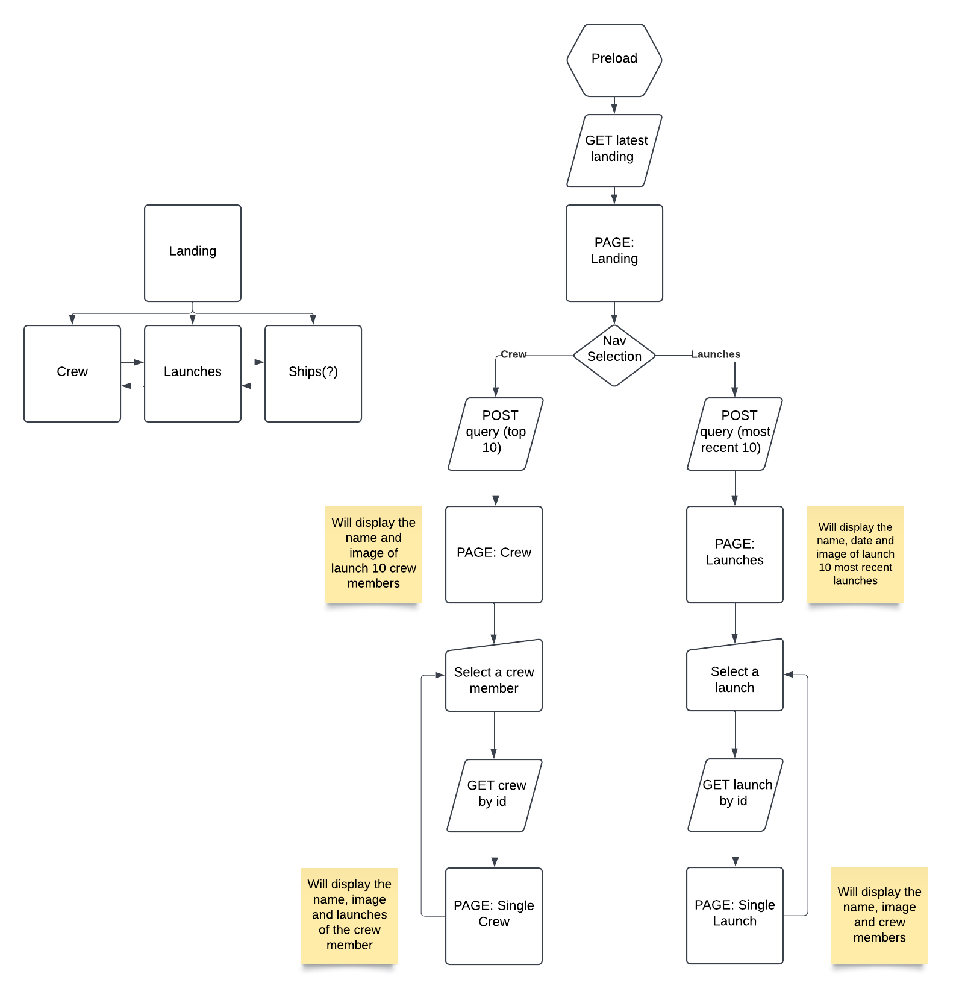

# ARCH-tech_test

### Task

We would like you to write a small NextJs application which demonstrates your ability to consume
data from an API, manage the state returned and show it to the end user.

We have supplied a link to the space X api documentation where you will find a bunch of different
endpoints across multiple controllers to explore. We would like you to integrate with at least 2
endpoints of your choice.

- Both endpoints should be accessible from anywhere within the application.
- The application should have 2 pages where each page should show data from one endpoint.
  The data shown should be scoped to the page it is displayed on.
- How you display this data and the rest of the app to the end user is up to you but as a
  minimum we would like it to be responsive.
- Please use any remaining time to impress us.

### Notes

- spacex-key is used to pass api key (used on all create, update, delete routes (which don't seem to exist?))
- /query routes support pagination, custom queries and output controls
  - default /query body is (follows mongoose query format):
    ```json
    {
      "query": {},
      "options": {}
    }
    ```
  - /query routes use populate arrays to fill out missing information (or you can grab the uuid and refetch)
- endpoints: launches (v5), crew, ships(?)

### Current Application

Currently, the application contacts three endpoints of the SpaceX api:

- https://api.spacexdata.com/v5/launches/latest
- https://api.spacexdata.com/v4/crew/query
- https://api.spacexdata.com/v4/crew/:id

The latest launch call is used on the home screen and can be clicked to go (nowhere currently but this is where the launch pages would've been hooked up - explained in the next section). When the Crew link is selected on the nav bar you're taken to a page where 10 crew members are displayed, these details are populated using the crew query call. Any of these crew members can be clicked to go to their specific crew page which will reveal a little more info about them (a list of their missions - or launches). The specific pages are populated using a call to the crew :id endpoint. Each launch is clickable and would take you to their specific launch page (but this is currently non functional).

### Improvements

- Replace next api calls with api calls in the components as this would allow for serverside components instead of having to put everything on the client
- Create an api call wrapper so code isn't as samey in some places. Currently, api calls are all done in their specific component but, due to the calls all working extremely similarly this would've benefitted from a single hook to make these calls that could just be used in each component.
- Finish launches calls
- Improve current types (in the types.ts file and otherwise)
- Weird naming in tailwind config
- Swap out some larger components (i.e. Landing.tsx) with a nested Layout
- Currently not including Loading or Error files which would make the overall experience better (especially due to the missing Launch pages)

### Planning


